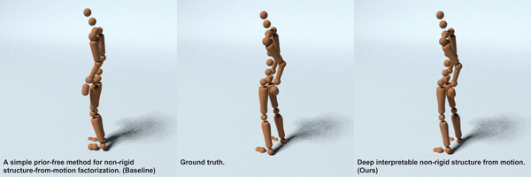
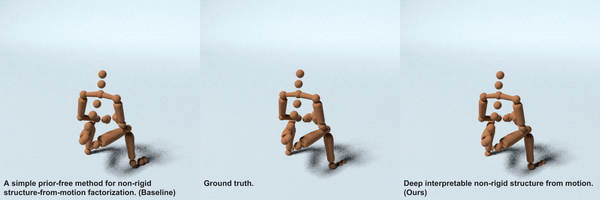
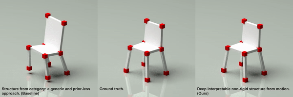

# Deep Interpretable Non-Rigid Structure from Motion
This repository contains code for the deep interpretable Non-Rigid Structure
from Motion (NRSfM) method.

Paper: https://arxiv.org/abs/1902.10840







## Prerequisites
We implement our neural network using python3 with these additional packages:
- [`TensorFlow`](https://www.tensorflow.org/) for NN building, training and evaluation.
- [`pandas`](https://pandas.pydata.org/) for result analysis.
- [`plotly`](https://plot.ly/)  for quick visualization.

You might want to setup Jupyter Notebook for future visualization.

## Guide
Our current release has been tested on Ubuntu 16.04.5 LTS.

To get the code, in terminal, run:
```sh
git clone https://github.com/kongchen1992/deep-nrsfm.git
```

### Data
We use [CMU Graphics Lab Motion Capture Database ](http://mocap.cs.cmu.edu/) to
train and test our neural network. We create TFRecords for convenience of
training and evaluation. You can download the TFRecords file of subject 23
(http://www.cs.cmu.edu/~chenk/deep-nrsfm/23.train) for demo.

### Pre-trained models
We offer a pre-trained model for subject 23 for the purpose of demo. You can
download it from (http://www.cs.cmu.edu/~chenk/deep-nrsfm/23.tar.gz), unzip and save for demo.

### Evaluate pre-trained models
We first change three paths:
- `path['tfrecords']` in file `motion_capture.py`: your path to TFRecords.
- `root` in file `evaluate.sh`: your path to model checkpoints i.e. the directory of downloaded pre-trained model.
- `output` in file `evaluate.sh`: your path to the result directory.

After changing the paths, simply run in terminal:
```sh
./evaluate.sh
```
This script will run the provided model with provided TFRecords and save errors
into CSV file and predictions into NPZ file. You should be able to see `23.csv`
and `23.npz` in your result directory.

### Visualize predictions
We offer a Jupyter notebook file for you to quickly check quantitative and qualitative results after evaluation. Start Jupyter by running in terminal:
```sh
jupyter notebook
```
and then open the provided `Visualization.ipynb` in web UI. After properly setting
the path to your evaluations and running the page, you will be able to see the evaluation results and visualizations. An example is demonstrated here (http://www.cs.cmu.edu/~chenk/deep-nrsfm/Visualization.html).


### Train a new model
We also offer a script `train.sh` for you to train a new model. After changing
- `path['tfrecords']` in file `motion_capture.py`: your path to TFRecords.
- `root` in file `train.sh`: your path to desired model directory.

You are able to train your own model by simply running in terminal:
```sh
./train.sh
```


## Reference
If you use the code, please cite:

    @misc{1902.10840,
      Author = {Chen Kong and Simon Lucey},
      Title = {Deep Interpretable Non-Rigid Structure from Motion},
      Year = {2019},
      Eprint = {arXiv:1902.10840},
    }

For any questions, please contact Chen Kong (chenk@cs.cmu.edu).
